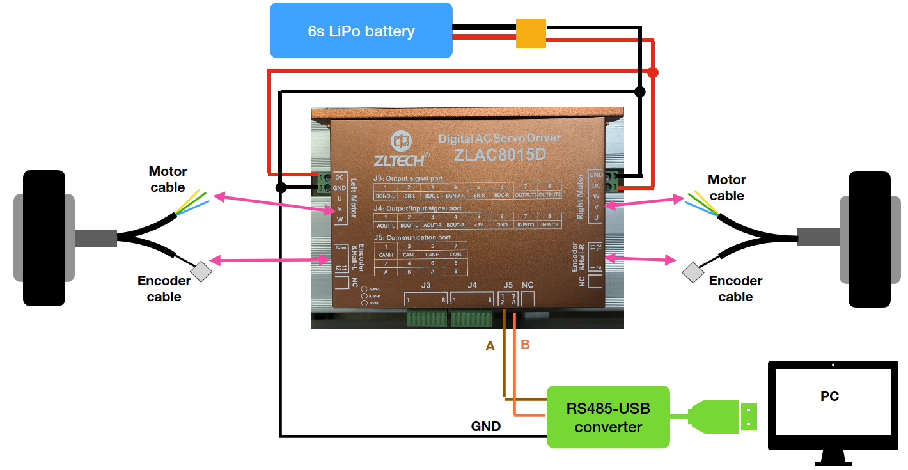

# ZLAC8015D Driver - ROS2 Package

This package provides a C++ driver and ROS2 node for controlling the ZLAC8015D dual-motor controller via Modbus RTU over serial communication.

## Wiring Diagram

<figure style="margin:0; text-align:center; border:1px solid #eaecef; padding:6px; border-radius:6px;">
  
</figure>

## Package Structure

- **Driver Library** (`zlac8015d_driver.h/cpp`): Standalone Modbus RTU interface to the ZLAC8015D hardware
- **ROS2 Node** (`wheels_driver.cpp`): ROS2 wrapper providing velocity control via `geometry_msgs/Twist`
- **Test Application** (`test_driver.cpp`): Standalone test utility for driver validation

---

## Installation

### Prerequisites

```bash
sudo apt-get update
# Needed to use the driver
sudo apt-get install -y libmodbus-dev 
# Needed to use with ROS2
sudo apt-get install ros2 colcon-common-extensions
```

### Clone

```bash
cd ~/colcon_ws/src
git clone https://github.com/JossueE/ZLAC8015D_cpp_driver

```

---

## Usage

### Standalone Driver (Without ROS2)

**Compile the test application:**
```bash
cd ~/colcon_ws
g++ -std=c++17 src/zlac8015d_driver/zlac8015d_driver.cpp src/zlac8015d_driver/test_driver.cpp -o test_driver -lmodbus
```

**Run tests:**
```bash
./test_driver /dev/ttyUSB0
```

### ROS2 Node

**Build**
```bash
cd ~/colcon_ws
colcon build --packages-select zlac8015d_driver2_cpp
source install/setup.bash
```

**Launch the test driver:**
```bash
# test_driver is also executable with ROS2 interface
ros2 run zlac8015d_driver2_cpp test_driver /dev/ttyUSB0
```

**Launch the node:**
```bash
ros2 run zlac8015d_driver2_cpp wheels_driver /dev/ttyUSB0
```

**Send velocity commands:**
```bash
ros2 topic pub /cmd_vel_safe geometry_msgs/msg/Twist "{linear: {x: 0.5}, angular: {z: 0.1}}"
```

**Monitor wheel data:**
```bash
ros2 topic echo /wheel/left_data
ros2 topic echo /wheel/right_data
```

---

## Configuration

Edit ROS2 parameters in your launch file or via command line:

```bash
ros2 run zlac8015d_driver2_cpp wheels_driver /dev/ttyUSB0 \
    --ros-args \
    -p wheel_radius:=0.1 \
    -p wheels_separation:=0.4 \
    -p accel_time_ms:=3000 \
    -p VelocityGains.left.kp:=60 

# You can set more values, pleas check the node as reference
```


